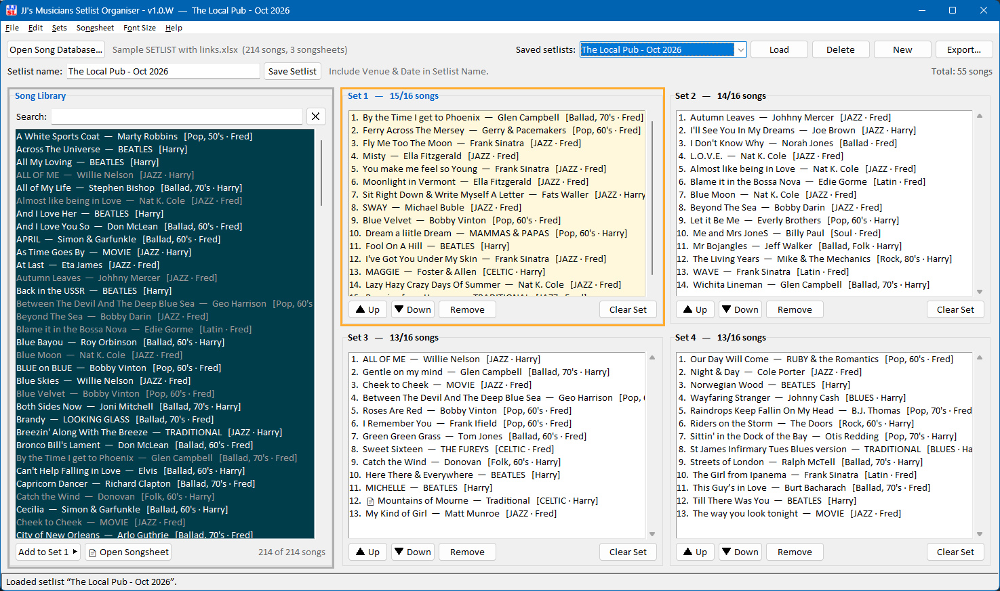

<p align="center">
  
</p>

<h1 align="center">JJ's Musicians Setlist Organiser</h1>

<p align="center">
  Build, reorder, save and print gig setlists from your song spreadsheet —<br>
  with one-click access to each song's PDF songsheet.<br>
  <b>Windows</b>, <b>macOS</b> and <b>Linux</b> · Python 3 · Tkinter
</p>

---



## Features

- **4 sets of up to 16 songs**, side by side, with the current set clearly highlighted. Each set shows its approximate running time (about 3½ minutes a song).
- **Drag and drop** songs from the library into any set, reorder within a set, move between sets, or drag back to the library to remove. Buttons and keyboard shortcuts do the same.
- **Backup song database on Google Drive** — *File ▸ Song Database Settings* takes the Drive share link of the same spreadsheet. The app falls back to it (with a clear **⚠ BACKUP** notice) if the main file can't be loaded, or can use it first so every computer always has the latest version. The last download is kept for offline use.
- **Song library from Excel** (`.xlsx`) or **CSV**, with instant search across song name, artist, style and vocalist. Songs already in the setlist are greyed out.
- **Songsheet links** — each song can link to its PDF songsheet (e.g. on Google Drive). Songs with a link show 📄; double-click a song in a set (or press Ctrl+P) to open it.
- **Save and load named setlists** (e.g. *"Venue Name - March 2027"*), pick them from a dropdown. If a setlist was made with a different song database and some of its songs are missing, the app offers to load the right database first.
- **Landscape printing** of a setlist or the whole song list: aligned columns, a set is never split across pages, two full 16-song sets fit on one A4 page, page numbers in the footer. Choose the printer in **File ▸ Printer**.
- **Save as PDF** — *File ▸ Save Setlist as PDF…* makes the same landscape layout as a PDF, ready to email to the band or a venue.
- **Save a setlist as a text file** (or CSV), and **export the song database as CSV with the web links written out**.
- **Adjustable text size and colours** — *Font Size ▸ Songlist & Setlist Colours* has a colour wheel with a live preview for the song library and the active setlist, plus a readability (contrast) check. You can colour the songlist background, song titles, songs already in a set, the selected song, the **Song Library frame**, and the active setlist's frame and background. Remembered window size and position.
- **Friendly first start** — finds a song spreadsheet or Google Drive link placed next to the app, or shows a *Welcome* window (open a spreadsheet, use a Drive link, create a template, or read the guide). Warns if the app is run from inside a zip file.
- **Built-in help**: basics, keyboard shortcuts, spreadsheet and CSV set-up guides, and template generators.
- **One codebase for Windows, Mac and Linux** — it detects the system and adapts shortcuts (Ctrl ↔ Cmd), right-click, fonts, printing and where data is stored.

---

## Downloads

Get the latest version from the **[Releases page](https://github.com/SunflowerGUY/JJ-s-Musicans-Setlist-Organiser/releases/latest)**, or download directly:

| System | Download | Then |
|---|---|---|
| Windows | [`JJs-Setlist-Windows.exe`](https://github.com/SunflowerGUY/JJ-s-Musicans-Setlist-Organiser/releases/latest/download/JJs-Setlist-Windows.exe) | Put it in a folder of its own and double-click it (see *Windows* below) |
| macOS | [`JJs-Setlist-Mac.zip`](https://github.com/SunflowerGUY/JJ-s-Musicans-Setlist-Organiser/releases/latest/download/JJs-Setlist-Mac.zip) | Unzip and follow `READ ME FIRST - Mac.txt` |
| Linux | [`JJs-Setlist-Linux.zip`](https://github.com/SunflowerGUY/JJ-s-Musicans-Setlist-Organiser/releases/latest/download/JJs-Setlist-Linux.zip) | Unzip and run `./run.sh` (see *Linux* below) |

The same packages are also kept in the [`packages`](packages) folder.

---

## Getting started

### Windows

**Option A — the ready-made app:** double-click `JJs Setlist.exe`.
It's a single portable file (no installation) — keep it in the same folder as your song spreadsheet and the `setlists` folder.

> The first time on a new PC, Windows SmartScreen may say *"Windows protected your PC"* because the app isn't code-signed. Click **More info → Run anyway**.

**Option B — run from source:**

```bash
pip install openpyxl
python jjs_setlist.py
```

### macOS

Install **Python 3 from [python.org](https://www.python.org/downloads/macos/)** (it includes Tk; Homebrew's Python doesn't). Then either:

- **Run directly** — double-click `Run JJs Setlist.command` (no build needed; handy while updates arrive often), or
- **Build a proper app** — double-click `Build Mac App.command` to create `JJs Setlist.app`.

On a Mac, settings and saved setlists live in `Documents/JJs Setlist`, and setlists shipped with an update are imported automatically (existing ones are never overwritten). Full step-by-step instructions are in [`READ ME FIRST - Mac.txt`](READ%20ME%20FIRST%20-%20Mac.txt).

### Linux

Install Python's Tk toolkit if it isn't there already (e.g. `sudo apt install python3-tk python3-venv` on Ubuntu/Debian), then in the `LINUX VERSION` folder:

```bash
./run.sh        # start the app (the first run installs openpyxl into a private .venv)
./install.sh    # optional: add it to the applications menu
```

As on a Mac, settings and saved setlists live in `~/Documents/JJs Setlist`, and setlists shipped with an update are imported automatically. Commands for other distributions, printing and troubleshooting are in [`LINUX VERSION/README.md`](LINUX%20VERSION/README.md).

---

## Your song spreadsheet

The library is read from the **first worksheet** of an Excel workbook (or a CSV). Row 1 holds the headings — any order, capitals don't matter, extra columns are ignored:

| Heading | Required | Also accepted |
|---|---|---|
| **SONG NAME** | ✅ | Title, Song, Song Title, Name, Track |
| **Artist** | | Band, Performer, Original Artist |
| **Style** | | Genre, Type |
| **Vocalist** | | Singer, Vocals, Vocal, Lead Vocal |
| **Songsheet** | | Link, URL, PDF, Sheet, Chart |

**Songsheet links** can be:

- **embedded behind the song name** in Excel (select the cell, **Ctrl+K**, paste the link) — the neatest option, `.xlsx` only;
- a `=HYPERLINK("url", "Song name")` formula; or
- written out in a **Songsheet** column — this also works in CSV files.

> ⚠️ **Save as an Excel Workbook (`.xlsx`).** Saving as CSV throws away every embedded link. If you need a CSV, use **File ▸ Export Song Database as CSV (with web links)**, which writes the links into a Songsheet column.

Not sure where to start? **Help ▸ Create Template Spreadsheet…** (or **…CSV…**) makes a ready-to-fill file with example rows.

---

## Using the app

1. **File ▸ Open Song Database…** and choose your spreadsheet (remembered next time).
2. Click a set to make it current (coloured frame and blue title), then **double-click** library songs to add them — or drag them in.
3. Reorder with drag and drop, **Alt+↑ / Alt+↓**, or the **▲ Up / ▼ Down** buttons.
4. Type a name (include venue and date) and **Save Setlist** (Ctrl+S).
5. **File ▸ Print This Setlist…** (Ctrl+Shift+P).

### Keyboard shortcuts

| Action | Windows & Linux | Mac |
|---|---|---|
| Open song database | Ctrl+O | Cmd+O |
| Reload song database | F5 | F5 |
| New / Save / Save As | Ctrl+N / Ctrl+S / Ctrl+Shift+S | Cmd+N / Cmd+S / Cmd+Shift+S |
| Print setlist | Ctrl+Shift+P | Cmd+Shift+P |
| Find song | Ctrl+F | Cmd+F |
| Go to Set 1–4 / library | Ctrl+1…4 / Ctrl+L | Cmd+1…4 / Cmd+L |
| Move song up / down | Alt+↑ / Alt+↓ | Option+↑ / Option+↓ |
| Remove song from set | Delete | delete |
| Open songsheet | Ctrl+P | Cmd+P |
| Text size larger / smaller / normal | Ctrl+ + / Ctrl+ − / Ctrl+0 | Cmd+ + / Cmd+ − / Cmd+0 |

The full list is in **Help ▸ Keyboard Shortcuts**.

---

## Building

| Platform | Double-click | Produces |
|---|---|---|
| Windows | `Build EXE.bat` | `JJs Setlist.exe` (single portable file, ~30 MB) |
| macOS | `Build Mac App.command` | `JJs Setlist.app` |
| Linux (optional) | `./build.sh` in `LINUX VERSION` | `JJs Setlist` (single program file) — most Linux users just use `./run.sh` |

The Windows and Mac scripts install what they need (PyInstaller, openpyxl, Pillow) on first run, close the app if it's running, and rebuild the icon, About-window logo and help-tip bulb from `ARTWORK/JJ SETLIST Icon Source.png`, `ARTWORK/JJ SETLIST Logo Source.png` and `ARTWORK/TIP LIght Bulb #1.png` via `make_icons.py`. An app must be built on the system it's for — a Windows PC can't build the Mac or Linux app.

The version shown in the title bar and *Help ▸ About* gets a letter for the system it's running on — `1.5.W` (Windows), `1.5.M` (Mac), `1.5.L` (Linux) — so change only the number in `APP_VERSION` for a new release.

**Sending an update to a Mac user:** double-click `Make Mac Package.bat`. It refreshes the `APPLE MAC VERSION` folder and creates `JJs Setlist - Mac.zip` (with Mac line endings and executable permissions intact), including the song spreadsheet and saved setlists.

**Sending an update to a Linux user:** double-click `Make Linux Package.bat`. It copies the latest app, spreadsheet and setlists into `LINUX VERSION` — a small repository of its own, ready to publish — and creates `JJs Setlist - Linux.zip` (Linux line endings, runnable `.sh` scripts). The Linux-only files there (`README.md`, `run.sh`, `install.sh`, `build.sh`) are edited in that folder and kept.

---

## Project files

| File | Purpose |
|---|---|
| `jjs_setlist.py` | The application — one script for Windows, macOS and Linux |
| `logo_data.py` | The logo baked in as base64 (generated — edit the artwork, not this) |
| `make_icons.py` | Rebuilds `setlist.ico` (from `JJ SETLIST Icon Source.png`) and `logo_data.py` (from `JJ SETLIST Logo Source.png`) |
| `Build EXE.bat` | Windows build script |
| `Build Mac App.command` | macOS build script |
| `Run JJs Setlist.command` | macOS launcher — runs `jjs_setlist.py` without building |
| `make_mac_package.py`, `Make Mac Package.bat` | Package everything for a Mac user |
| `READ ME FIRST - Mac.txt` | Step-by-step instructions for Mac users |
| `make_linux_package.py`, `Make Linux Package.bat` | Refresh `LINUX VERSION` and zip it for a Linux user |
| `LINUX VERSION/` | The Linux mini repository: launcher, menu installer, optional build script and its own README |
| `colour_picker.py` | Stand-alone colour wheel that the in-app colour picker was adapted from |
| `Sample SETLIST with links.xlsx` | Example song database — three songs link to their songsheets in `songsheets/` |
| `songsheets/` | Example songsheet PDFs (traditional songs), opened from the sample spreadsheet |
| `docs/` | The screenshot for this README |
| `ARTWORK/` | Logo artwork |
| `setlists/` | Saved setlists (JSON) |
| `packages/` | The ready-built Windows app and the Mac and Linux zips |

**Where data is kept**

| | Settings (`config.json`) and `setlists/` |
|---|---|
| Windows | Next to `JJs Setlist.exe` (or `jjs_setlist.py`) — the whole folder is portable |
| macOS | `~/Documents/JJs Setlist` |
| Linux | `~/Documents/JJs Setlist` |

`config.json` remembers the song database (and its Google Drive link), chosen printer, text size, songlist & setlist colours and window position. `drive_copy.xlsx` is the last download of the Google Drive copy, kept for offline use.

## Requirements

- Python 3.10+ with Tk (bundled with the python.org installers; a separate package on most Linux distributions, e.g. `python3-tk`)
- [`openpyxl`](https://pypi.org/project/openpyxl/) — to read Excel files
- For building: [`pyinstaller`](https://pypi.org/project/pyinstaller/), [`pillow`](https://pypi.org/project/pillow/)

Printing on Windows uses the .NET printing built into Windows (via PowerShell). On macOS and Linux the app builds a PDF itself (a small built-in PDF writer, no extra packages) and sends it to the printer with the standard `lp` command (CUPS), so the printed layout is the same on every system.

## Support

JJ's Musicians Setlist Organiser is free and open source. If it's useful to you, you can buy us a coffee ☕ — any amount, entirely optional:
**[paypal.me/jellyjazzsoftware](https://paypal.me/jellyjazzsoftware)** (also in the app: *Help ▸ Support JJ's Musicians Setlist Organiser*).

## Licence

Released under the [MIT Licence](LICENSE): free to use, copy, change and share, including in your own projects, as long as the copyright notice goes with it.

## Credits

Brought to you by **JELLY JAZZ**.  
Vibe coding by **Adrian Newington** — [github.com/SunflowerGUY](https://github.com/SunflowerGUY) — built together with [Claude Code](https://claude.com/claude-code).
